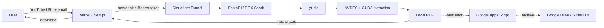
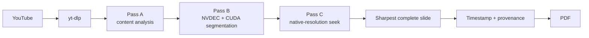

<div align="center">

# SlideExtractor
### Vision From YouTube

**GPU-accelerated slide extraction from public YouTube presentations — powered by NVIDIA DGX Spark.**

[](https://www.nvidia.com/en-us/products/workstations/dgx-spark/)
[](https://developer.nvidia.com/cuda-zone)
[](https://nextjs.org/)
[](https://fastapi.tiangolo.com/)

**[Open the live application](https://vision-from-youtube.vercel.app)** · [Architecture](docs/ARCHITECTURE.md) · [Deployment](docs/DEPLOYMENT.md) · [Operations](docs/OPERATIONS.md) · [White Paper source](docs/WHITEPAPER.tex)

*Robotics Computing Lab · Tecnológico de Monterrey*

</div>

---

## What it does

SlideExtractor turns a public YouTube presentation into a clean PDF containing the **distinct, most complete slide states** found in the video. It removes redundant frames, preserves provenance and timestamps, and performs the computationally intensive work on a local **NVIDIA DGX Spark**.

The browser submits a YouTube URL and an email identifier. Vercel proxies the request to a FastAPI worker through Cloudflare Tunnel; the Spark downloads and analyzes the video, creates the PDF and makes it immediately downloadable. A copy is then archived asynchronously in Google Drive.

> **No LLM inference is used in the video-processing pipeline.** Slide detection is deterministic computer vision accelerated with FFmpeg/NVDEC, OpenCV and PyTorch/CUDA.

## Design principle: delivery first

The most important architectural decision is simple:

> **A successfully generated local PDF is enough to declare the job complete.**

Google Drive is deliberately kept outside the critical user path. If Apps Script or Drive fails, the user can still download the PDF.



## System at a glance

| Layer | Technology | Responsibility |
|---|---|---|
| Public UX | Next.js + Vercel | Form, progress, status polling, PDF download |
| Secure bridge | Cloudflare Tunnel | Outbound-only access to the local worker |
| Control plane | FastAPI + Uvicorn | Queue, job state, authentication, PDF streaming |
| Video acquisition | yt-dlp + FFmpeg | Public YouTube video retrieval and decoding |
| GPU processing | NVDEC + CUDA + PyTorch | Efficient frame analysis and slide segmentation |
| Vision | OpenCV + NumPy + Pillow | De-duplication, sharpness and slide-state selection |
| Output | PDF | Timestamped/provenance-aware slide document |
| Archive | Apps Script + Google Drive | Asynchronous secondary copy in `SlidesOut` |

## User experience

1. Paste a public YouTube URL.
2. Enter an email address used only as the PDF identifier/name.
3. Follow extraction progress in the browser.
4. When the PDF exists, the job becomes `done` and the browser enables download immediately.
5. The system archives a secondary copy in Google Drive without blocking delivery.

## Extraction pipeline



Conceptually the extractor operates in three stages:

- **Pass A — content analysis:** keyframe/content analysis and noise filtering.
- **Pass B — GPU segmentation:** reduced-rate slide-state segmentation using hardware decoding and CUDA-assisted analysis.
- **Pass C — final capture:** native-resolution seek, sharpest-frame selection, provenance/timestamp stamping and PDF rendering.

## Repository map

```text
Vision-From-Youtube/
├── README.md
├── SECURITY.md
├── CHANGELOG.md
├── .gitignore
├── docs/
│   ├── ARCHITECTURE.md
│   ├── DEPLOYMENT.md
│   ├── OPERATIONS.md
│   ├── PROJECT_STRUCTURE.md
│   ├── PROJECT_DOCUMENTATION.md
│   └── WHITEPAPER.tex
├── google_apps_script/
│   └── Code.gs
├── spark_worker/
│   ├── app.py
│   ├── requirements.txt
│   ├── .env.example
│   ├── _parts/
│   │   ├── extractor.part01
│   │   ├── extractor.part02
│   │   ├── extractor.part03
│   │   └── extractor.part04
│   ├── scripts/
│   │   └── install_spark.sh
│   ├── systemd/
│   │   └── slideextractor-worker.service
│   └── cloudflared/
│       └── config.yml.example
└── web/
    ├── package.json
    ├── tsconfig.json
    ├── vercel.json
    ├── .env.example
    └── app/
        ├── layout.tsx
        ├── page.tsx
        ├── globals.css
        └── api/jobs/
            ├── route.ts
            └── [id]/
                ├── route.ts
                └── download/route.ts
```

See [`docs/PROJECT_STRUCTURE.md`](docs/PROJECT_STRUCTURE.md) for the role of each source file.

## API contract

The Spark worker exposes:

```text
GET  /health
POST /v1/jobs
GET  /v1/jobs/{job_id}
GET  /v1/jobs/{job_id}/pdf
```

The job endpoints are protected with a Bearer token and are intended to be called by Vercel, not directly by the browser. The worker binds to `127.0.0.1:8000` and is exposed externally only through Cloudflare Tunnel.

## Configuration

### NVIDIA DGX Spark

See [`spark_worker/.env.example`](spark_worker/.env.example).

```text
SLIDEEXTRACTOR_API_KEY=...
MAX_QUEUE=8
MAX_HEIGHT=1080
KEEP_LOCAL_RESULTS=1
JOBS_DIR=/home/alberto/slideextractor/jobs
DRIVE_BRIDGE_URL=https://script.google.com/macros/s/.../exec
DRIVE_BRIDGE_SECRET=...
```

### Vercel

See [`web/.env.example`](web/.env.example).

```text
SPARK_API_URL=https://<cloudflare-tunnel-hostname>
SPARK_API_KEY=<same bearer secret used by Spark>
```

Never expose either key with a `NEXT_PUBLIC_` prefix.

## Operations

Typical Spark health check:

```bash
sudo systemctl status slideextractor-worker
curl http://127.0.0.1:8000/health
```

Expected response:

```json
{"ok": true, "queue": 0, "max_queue": 8}
```

A quick HTTP/2 tunnel can be started with:

```bash
cloudflared tunnel --protocol http2 --url http://127.0.0.1:8000
```

For long-running deployments, use a named tunnel and a persistent service. Full procedures are in [`docs/OPERATIONS.md`](docs/OPERATIONS.md).

## Security model

- The browser never receives the Spark API key.
- Vercel is the public application boundary.
- FastAPI listens on loopback only.
- Cloudflare Tunnel avoids inbound port forwarding.
- Job IDs use UUIDs.
- PDF delivery is proxied through Vercel.
- Google Drive is not required for successful user delivery.
- Real secrets and `.env` files must never be committed.

See [`SECURITY.md`](SECURITY.md) for operational hardening notes.

## Technical documentation

| Document | Purpose |
|---|---|
| [`ARCHITECTURE.md`](docs/ARCHITECTURE.md) | System design, invariants and data flow |
| [`DEPLOYMENT.md`](docs/DEPLOYMENT.md) | Spark, Cloudflare, Vercel and Apps Script deployment |
| [`OPERATIONS.md`](docs/OPERATIONS.md) | Health checks, restart sequence and troubleshooting |
| [`PROJECT_STRUCTURE.md`](docs/PROJECT_STRUCTURE.md) | Source-tree reference |
| [`PROJECT_DOCUMENTATION.md`](docs/PROJECT_DOCUMENTATION.md) | Compact project-level technical overview |
| [`WHITEPAPER.tex`](docs/WHITEPAPER.tex) | Formal LaTeX white paper source |

## Why this architecture matters

SlideExtractor is an example of a useful hybrid pattern: **a lightweight public cloud interface coordinating specialised local GPU infrastructure without exposing the GPU host directly to the Internet**.

The DGX Spark stays close to the video and vision workload; Vercel provides the public experience; Cloudflare supplies the network bridge; and Google Drive acts as a secondary archive rather than a fragile dependency.

---

<div align="center">

### SlideExtractor · Vision From YouTube

**Prof. Alberto Muñoz**  
Robotics Computing Lab · Tecnológico de Monterrey

Built for research, teaching and experimentation with GPU-accelerated computer vision.

</div>
