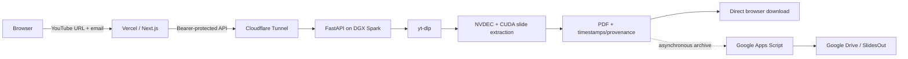

# SlideExtractor — YouTube to Slides on NVIDIA DGX Spark

SlideExtractor is a web service that extracts distinct presentation slides from public YouTube videos using a local NVIDIA DGX Spark as the GPU worker. The browser submits a YouTube URL and an email identifier; the Spark downloads and analyzes the video, removes repeated frames, preserves the most complete slide state, adds provenance/timestamps, builds a PDF, exposes it for direct download, and archives a copy in Google Drive under the requester's email address.

> **No LLM inference is used in the video-processing pipeline.** Slide detection is deterministic computer vision accelerated with FFmpeg/NVDEC and PyTorch/CUDA.

## Production flow



The critical design rule is that **PDF delivery does not depend on Google Drive**. As soon as the local PDF exists, the job becomes `done` and the download endpoint is enabled. Drive archival happens separately, so an Apps Script or Drive permission failure cannot block delivery to the user.

## Main components

- **`web/`** — Next.js frontend and Vercel API proxy.
- **`spark_worker/`** — FastAPI queue/worker and GPU extraction pipeline for the DGX Spark.
- **`google_apps_script/`** — minimal Google Apps Script bridge used only to archive the generated PDF in `SlidesOut`.
- **`docs/`** — architecture, deployment, operations and project-structure documentation.

## User experience

1. Paste a public YouTube URL.
2. Enter an email address. It is used only to identify/name the PDF; no email is sent.
3. The page shows extraction progress.
4. When complete, the browser attempts the download automatically and shows a persistent **Download PDF** button.
5. A copy is archived in Google Drive as `user@example.com.pdf`.

## Repository structure

```text
Vision-From-Youtube/
├── README.md
├── SECURITY.md
├── .gitignore
├── docs/
│   ├── ARCHITECTURE.md
│   ├── DEPLOYMENT.md
│   ├── OPERATIONS.md
│   └── PROJECT_STRUCTURE.md
├── google_apps_script/
│   └── Code.gs
├── spark_worker/
│   ├── app.py
│   ├── requirements.txt
│   ├── .env.example
│   ├── _parts/
│   │   ├── extractor.part01
│   │   ├── extractor.part02
│   │   ├── extractor.part03
│   │   └── extractor.part04
│   ├── scripts/
│   │   └── install_spark.sh
│   ├── systemd/
│   │   └── slideextractor-worker.service
│   └── cloudflared/
│       └── config.yml.example
└── web/
    ├── package.json
    ├── tsconfig.json
    ├── vercel.json
    ├── .env.example
    └── app/
        ├── layout.tsx
        ├── page.tsx
        ├── globals.css
        └── api/jobs/
            ├── route.ts
            └── [id]/
                ├── route.ts
                └── download/route.ts
```

## Spark worker

The Spark worker exposes:

- `GET /health` — public health check.
- `POST /v1/jobs` — creates an extraction job; Bearer protected.
- `GET /v1/jobs/{id}` — job state/progress; Bearer protected.
- `GET /v1/jobs/{id}/pdf` — streams the completed PDF; Bearer protected.

The worker binds to `127.0.0.1:8000` and is exposed externally only through Cloudflare Tunnel.

## Environment variables

### DGX Spark

See `spark_worker/.env.example`.

Important values:

```text
SLIDEEXTRACTOR_API_KEY=...
MAX_QUEUE=8
MAX_HEIGHT=1080
KEEP_LOCAL_RESULTS=1
JOBS_DIR=/home/alberto/slideextractor/jobs
DRIVE_BRIDGE_URL=https://script.google.com/macros/s/.../exec
DRIVE_BRIDGE_SECRET=...
```

### Vercel

See `web/.env.example`.

```text
SPARK_API_URL=https://<cloudflare-tunnel-hostname>
SPARK_API_KEY=<same bearer secret used by Spark>
```

Never expose either key using a `NEXT_PUBLIC_` prefix.

## Local Spark service

Typical service check:

```bash
sudo systemctl status slideextractor-worker
curl http://127.0.0.1:8000/health
```

The systemd service runs Uvicorn with one worker so the in-memory job queue remains consistent.

## Cloudflare Tunnel

The DGX Spark does not require inbound router configuration. `cloudflared` creates an outbound tunnel to the local FastAPI service. HTTP/2 is suitable where QUIC/UDP 7844 is blocked.

Example quick tunnel:

```bash
cloudflared tunnel --protocol http2 --url http://127.0.0.1:8000
```

For long-term operation, use a named tunnel and a persistent systemd service.

## Google Drive archive

`google_apps_script/Code.gs` receives the generated PDF, decodes the Base64 payload and stores it in the configured `SlidesOut` folder. The filename is derived from the requester's email.

Drive is an **archive path, not a delivery dependency**. The browser downloads through Vercel from the Spark endpoint.

## Extraction pipeline

Conceptually the extractor performs three stages:

```text
Pass A — content/keyframe analysis and noise filtering
Pass B — low-rate GPU slide segmentation with NVDEC/CUDA
Pass C — native-resolution seek, sharpest-frame selection and PDF rendering
```

The output keeps source provenance, including the original video context and timestamp for each selected slide.

## Security model

- Browser never receives the Spark API key.
- Vercel is the only public application-facing API layer.
- Spark listens on loopback only.
- Cloudflare Tunnel avoids inbound port forwarding.
- Job IDs are unguessable UUIDs.
- PDF download is proxied through Vercel.
- Drive files may remain private; user delivery does not require Drive sharing.
- Secrets and `.env` files must never be committed.

See [`SECURITY.md`](SECURITY.md) for operational security notes.

## Documentation

- [`docs/ARCHITECTURE.md`](docs/ARCHITECTURE.md) — system design and data flow.
- [`docs/DEPLOYMENT.md`](docs/DEPLOYMENT.md) — deployment/configuration steps.
- [`docs/OPERATIONS.md`](docs/OPERATIONS.md) — health checks and troubleshooting.
- [`docs/PROJECT_STRUCTURE.md`](docs/PROJECT_STRUCTURE.md) — role of every source file.

## Project identity

**SlideExtractor / Vision From YouTube**  
Prof. Alberto Muñoz  
Robotics Computing Lab  
Tecnológico de Monterrey
