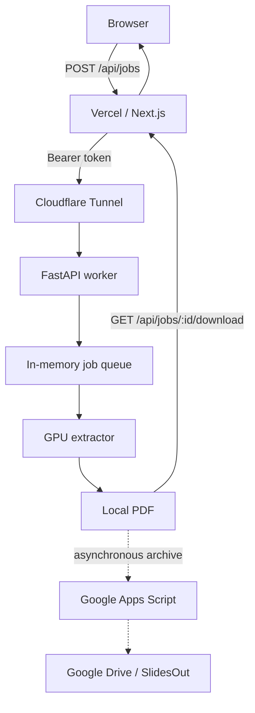
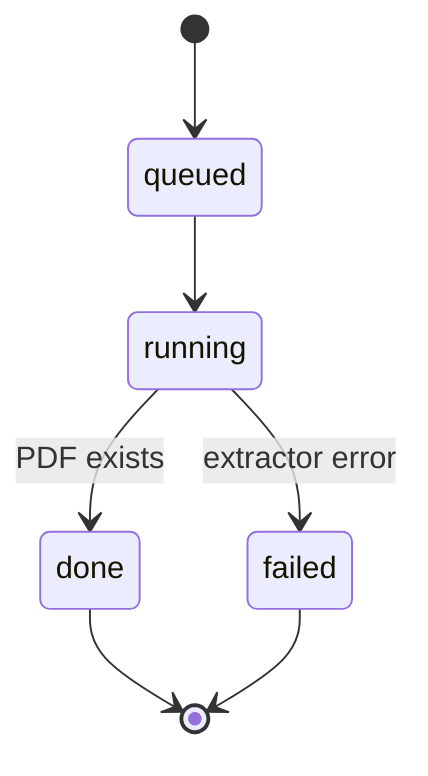
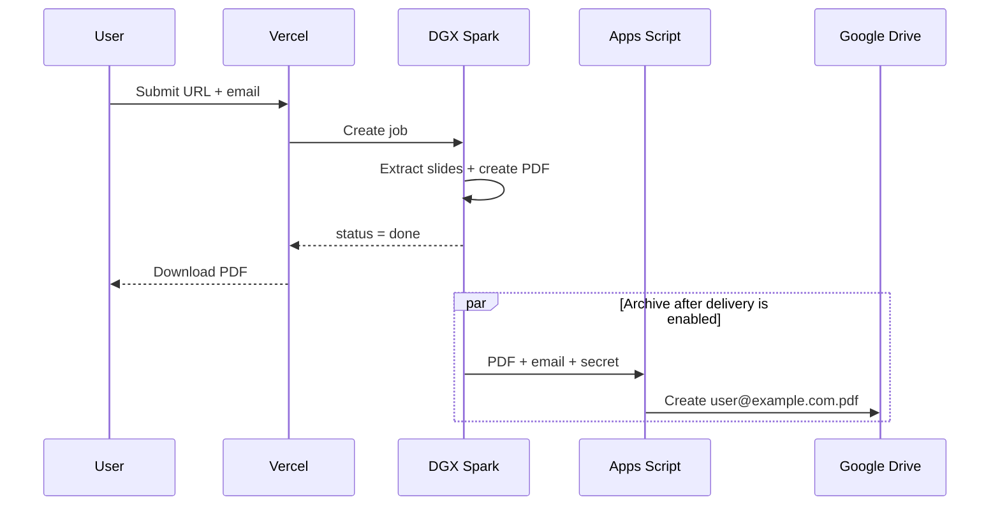

# SlideExtractor architecture

## Design objective

SlideExtractor converts a public YouTube presentation into a de-duplicated PDF while keeping GPU-heavy work on a local NVIDIA DGX Spark and exposing a simple web UI through Vercel.

The architecture intentionally separates **delivery** from **archival**:

- Delivery: Spark -> Vercel -> browser.
- Archival: Spark -> Apps Script -> Google Drive.

A Drive or Apps Script failure must never prevent the user from downloading a PDF that was already generated successfully.

## System diagram



## Control plane

The browser never communicates directly with the Spark. Next.js route handlers act as the public control plane:

- create job
- poll job state
- stream the completed PDF

The Vercel server adds the Bearer token before forwarding requests to the Spark.

## Spark worker

`fastapi + uvicorn` provide a lightweight local job service. A single Uvicorn worker is used because the queue is process-local.

Job lifecycle:



The important transition is `running -> done`: it occurs when the PDF and metadata exist locally, not when Google Drive finishes.

## Data plane

### Input

The browser submits:

```json
{
  "youtube_url": "https://www.youtube.com/watch?v=...",
  "email": "user@example.com"
}
```

The email is normalized and used as the PDF filename.

### Extraction

The GPU pipeline is derived from the validated notebook workflow and conceptually uses three passes:

1. **Pass A** — inspect content/keyframes and suppress low-information/noisy regions.
2. **Pass B** — perform slide segmentation at a reduced frame rate using FFmpeg NVDEC and GPU-assisted analysis.
3. **Pass C** — seek at native resolution, choose the sharpest representative frame, stamp provenance/timestamp and render the final PDF.

### Output

Local job directory:

```text
jobs/<job-id>/
├── job.json
├── extractor_status.json
├── extractor.log
└── output/
    ├── slides.pdf
    └── slides.json
```

The PDF is then available from `/v1/jobs/{job_id}/pdf` and is proxied by Vercel.

## Asynchronous Drive archive

After the PDF is available to the user, the worker may start a background archive operation:



This design prevents external archive latency or permissions from blocking the user-facing workflow.

## Network model

```text
Internet
   |
   v
Vercel
   |
   | HTTPS + Bearer secret
   v
Cloudflare Tunnel
   |
   v
127.0.0.1:8000
FastAPI on DGX Spark
```

No inbound port forwarding to the Spark is required.

## Technology stack

- Frontend/API proxy: Next.js / TypeScript / Vercel
- Edge-to-local connectivity: Cloudflare Tunnel
- Worker API: FastAPI / Uvicorn
- Video acquisition: yt-dlp
- Decode: FFmpeg NVDEC
- GPU compute: PyTorch/CUDA
- Image processing: OpenCV / NumPy / Pillow
- Archive: Google Apps Script + Google Drive
- Service management: systemd

## Architectural invariants

1. No LLM is required for slide extraction.
2. The Spark API key is never exposed to the browser.
3. The Spark worker remains bound to loopback.
4. PDF completion is determined locally.
5. Google Drive is secondary and asynchronous.
6. The user always has a direct download path independent of Drive.
