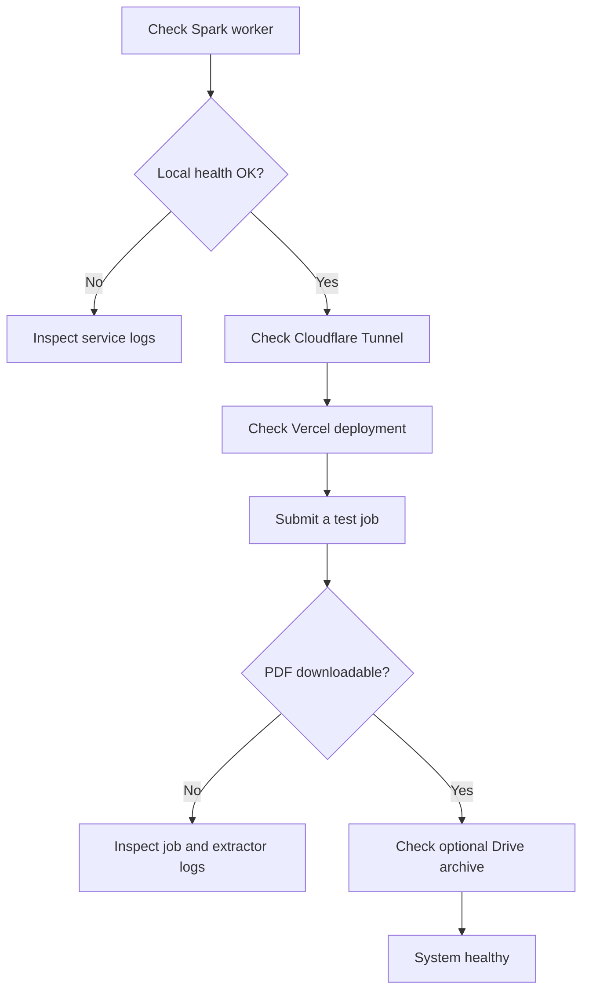

# SlideExtractor Operations

This document provides the public operational checklist for SlideExtractor without exposing deployment secrets.

## Service health

On the NVIDIA DGX Spark, verify the worker service and local health endpoint:

```bash
sudo systemctl status slideextractor-worker
curl http://127.0.0.1:8000/health
```

A healthy worker reports that the API is available together with queue information.

## Cloudflare Tunnel

The FastAPI service is designed to remain bound to loopback. Cloudflare Tunnel provides outbound connectivity between the local DGX Spark and the public Vercel application without inbound router port forwarding.

For temporary testing:

```bash
cloudflared tunnel --protocol http2 --url http://127.0.0.1:8000
```

For long-running operation, use a persistent named tunnel and keep all credentials outside the repository.

## Vercel

Production configuration:

```text
Repository: LuisAlbertoMunozUbando/Vision-From-Youtube
Production Branch: main
Root Directory: web
Framework: Next.js
```

Environment variables and authentication values must be configured only in the appropriate deployment dashboards or local environment files. Never commit real credentials.

## End-to-end validation

After a deployment or restart, verify the complete user path:

1. Open the public application.
2. Submit a short public YouTube presentation.
3. Confirm the job moves from `queued` to `running`.
4. Confirm progress is visible.
5. Confirm the job reaches `done` when the PDF exists.
6. Confirm the PDF downloads through the browser.
7. Confirm archival runs independently and cannot block the download.

The live application is:

https://vision-from-youtube.vercel.app

## Troubleshooting order



## Operational invariants

- A job is `done` when its local PDF exists and is downloadable.
- Google Drive archival is outside the critical user-delivery path.
- Browser code never receives backend credentials.
- The Spark worker remains on loopback unless the architecture is intentionally changed.
- Runtime credentials remain outside source control.
- An end-to-end PDF download is the final deployment validation.

## Quick checklist

- [ ] Spark worker is active.
- [ ] Local health endpoint responds.
- [ ] Cloudflare Tunnel is connected.
- [ ] Vercel deployment is healthy.
- [ ] A test job can be created.
- [ ] Progress updates correctly.
- [ ] The generated PDF downloads.
- [ ] Archive failures do not block user delivery.
