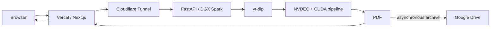
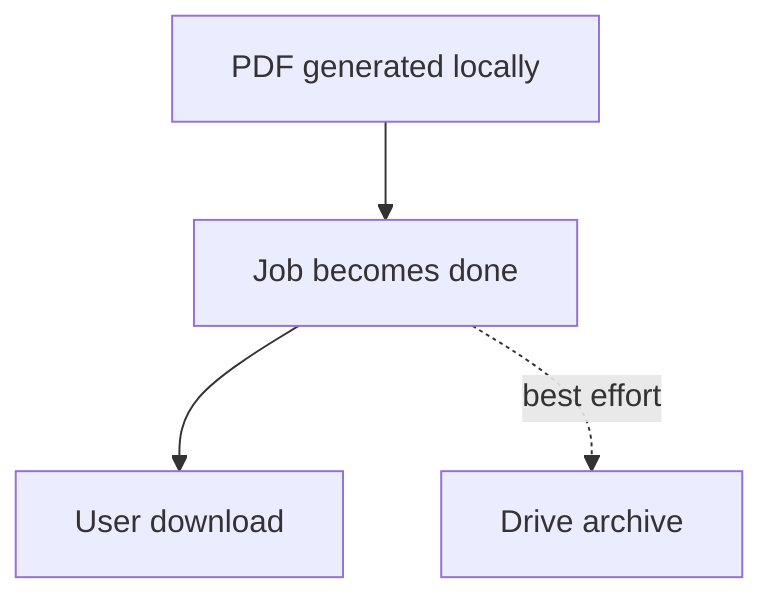
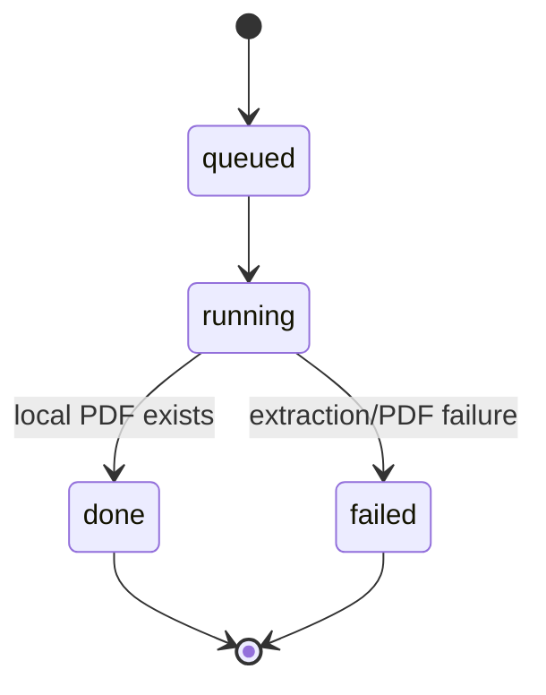

# SlideExtractor — Vision From YouTube
## Distributed GPU Architecture for YouTube Slide Extraction

**Prof. Alberto Muñoz**  
Robotics Computing Lab  
Tecnológico de Monterrey  
Version 1.0 · August 2026

---

## Executive summary

SlideExtractor is a distributed service that transforms public YouTube videos containing presentations into a PDF of distinct slides. It removes repeated visual states, preserves the most complete version of each slide, and keeps timestamp/provenance information with the generated document.

The computational workload runs locally on an NVIDIA DGX Spark, while the public web experience runs on Vercel. Cloudflare Tunnel links the cloud frontend to the local FastAPI worker without directly exposing the GPU host to the Internet.

The system uses a deterministic computer-vision pipeline rather than an LLM for slide extraction. Its main components include yt-dlp, FFmpeg/NVDEC, OpenCV, NumPy, Pillow and PyTorch/CUDA.

## Architecture

The browser never communicates directly with the DGX Spark. Vercel acts as the public application boundary and server-side proxy.

## Core engineering principle: delivery first

The most important reliability decision is to separate user delivery from archival.

Once the local PDF exists, the job becomes `done` and the user can download it immediately. Google Drive archival runs as a secondary asynchronous activity. A storage or archival problem therefore cannot invalidate an otherwise successful extraction.

## GPU extraction pipeline

The extractor can be understood as three stages:

1. **Pass A — content analysis.** Detect useful visual content and suppress noise.
2. **Pass B — GPU slide segmentation.** Analyze the video at reduced temporal frequency using hardware decoding and CUDA-assisted processing.
3. **Pass C — native-resolution capture.** Seek to the selected moments, choose the sharpest and most complete frame, add provenance/timestamp information and build the PDF.

## Job model

The archive path is deliberately absent from the state transition to `done`.

## System components

| Component | Role |
|---|---|
| Next.js / Vercel | Public interface, job orchestration, progress and download |
| Cloudflare Tunnel | Outbound bridge from public cloud to local worker |
| FastAPI / Uvicorn | Job queue, status API and PDF serving |
| NVIDIA DGX Spark | Local GPU compute platform |
| yt-dlp / FFmpeg | Video retrieval and decoding |
| NVDEC / CUDA / PyTorch | GPU acceleration |
| OpenCV / NumPy / Pillow | Visual processing and slide-state analysis |
| Google Apps Script / Drive | Secondary archive path |

## Reliability lessons

Several practical implementation issues shaped the final architecture: video formats may vary across YouTube sources; GPU/video dependencies need a consistent runtime environment; network policies may affect tunnel transport; and secondary storage systems can return failures even when the primary PDF output is valid.

The architectural response is to keep responsibilities independent and to define success by the artifact that matters to the user: the downloadable PDF.

## Operational model

A normal production flow consists of:

1. a healthy FastAPI worker on the DGX Spark;
2. an active Cloudflare Tunnel;
3. a Vercel deployment connected to the GitHub repository;
4. successful end-to-end creation and download of a PDF;
5. optional asynchronous archival.

Detailed operational instructions are available in [`OPERATIONS.md`](OPERATIONS.md), while implementation topology is described in [`ARCHITECTURE.md`](ARCHITECTURE.md) and deployment structure in [`DEPLOYMENT.md`](DEPLOYMENT.md).

## Future extensions

The architecture supports future additions such as persistent tunnel infrastructure, rate limiting, richer observability, automated cleanup policies, job recovery, multiple extraction profiles, metadata indexing, and optional AI-based summarisation as a separate layer from the deterministic visual extractor.

## Conclusion

SlideExtractor demonstrates a hybrid computing pattern in which a lightweight public cloud application coordinates specialised local GPU infrastructure without directly exposing the compute host. The DGX Spark remains close to the video and vision workload; Vercel provides the user experience; Cloudflare provides secure connectivity; and Google Drive serves as secondary archival storage.

The key engineering lesson is the separation of **what is required to deliver value to the user** from **what is useful for persistence and operations**. Making the local PDF the single condition for successful completion turns a fragile dependency chain into a clearer and more fault-tolerant architecture.

---

**Prof. Alberto Muñoz**  
Robotics Computing Lab · Tecnológico de Monterrey
